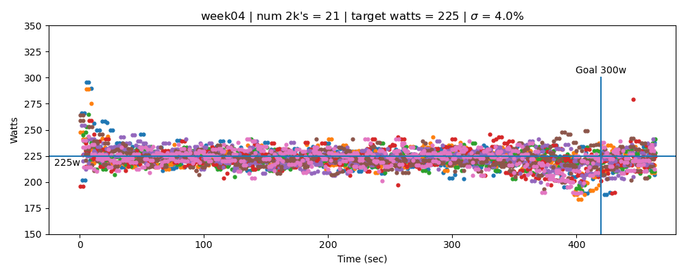
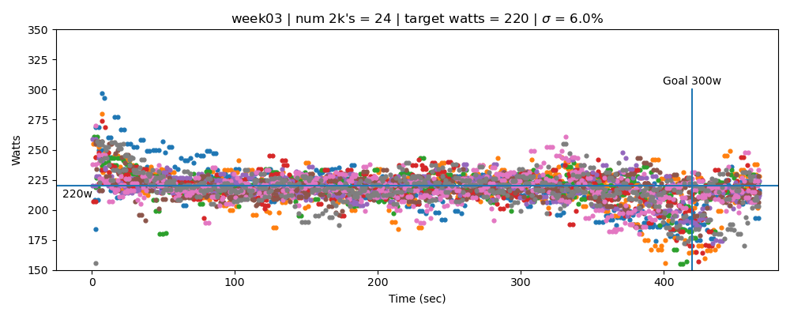
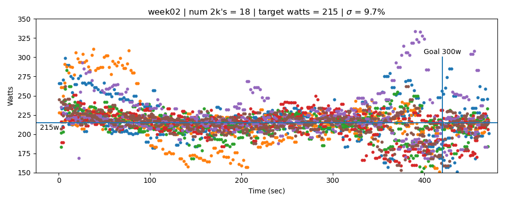
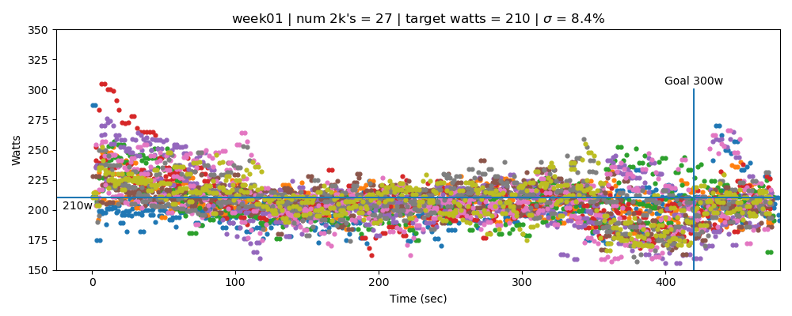

### Training for the 2022 CRASH-B

Before the CRASH-B in March 2021 I could do 3x2k/3m at about 265 watts (1:49.7/7:18.8). I did a
6:55.3 (313 watts). 

The primary training goal for this year is 3x2k/2m at 300 watts (1:45.3/7:01.2). A stretch goal!
The plan is work my way up from 210 watts with LOTS of volume.

The secondary training goal is to row at a very consistent pace. The plots should show decreasing
dispersion over time.

Not sure what the CRASH-B target is yet. (300/265)x313x0.95 ~ 340 watts? This would be 1:41/6:44.

#### Summary

33 sessions, 99x2k

##### Week 5: 230 Watts (9x2k)

| Date | Watts |
| ---- | ----- |
| 2021-11-23 | 230/231/230 |
| 2021-11-20 | 230/230/230 |
| 2021-11-18 | 230/230/230 |

##### Week 4: 225 Watts (21x2k)

| Date | Watts |
| ---- | ----- |
| 2021-11-14 | 225/225/225 |
| 2021-11-14 | 225/225/225 |
| 2021-11-13 | 225/225/225 |
| 2021-11-12 | 225/225/225 |
| 2021-11-12 | 225/225/225 |
| 2021-11-11 | 225/225/225 |
| 2021-11-10 | 225/225/225 |

##### Week 3: 220 Watts (24x2k)

| Date | Watts |
| ---- | ----- |
| 2021-11-08 | 220/220/220 |
| 2021-11-08 | 220/220/221 |
| 2021-11-07 | 220/220/220 |
| 2021-11-06 | 220/220/220 |
| 2021-11-06 | 220/220/220 |
| 2021-11-05 | 220/221/220 |
| 2021-11-05 | 220/220/220 |
| 2021-11-03 | 220/220/220 |

##### Week 2: 215 Watts (18x2k)

| Date | Watts |
| ---- | ----- |
| 2021-11-02 | 215/214/215 |
| 2021-11-01 | 215/215/215 |
| 2021-10-31 | 215/215/215 |
| 2021-10-31 | 215/215/215 |
| 2021-10-30 | 215/215/215 |
| 2021-10-28 | 215/215/215 |

##### Week 1: 210 Watts (27x2k)

| Date | Watts |
| ---- | ----- |
| 2021-10-24 | 210/210/210 |
| 2021-10-24 | 210/210/210 |
| 2021-10-24 | 210/210/210 |
| 2021-10-23 | 210/210/210 |
| 2021-10-23 | 209/210/210 |
| 2021-10-22 | 210/210/210 |
| 2021-10-22 | 210/210/210 |
| 2021-10-21 | 208/208/208 |
| 2021-10-20 | 203/202/203 |

